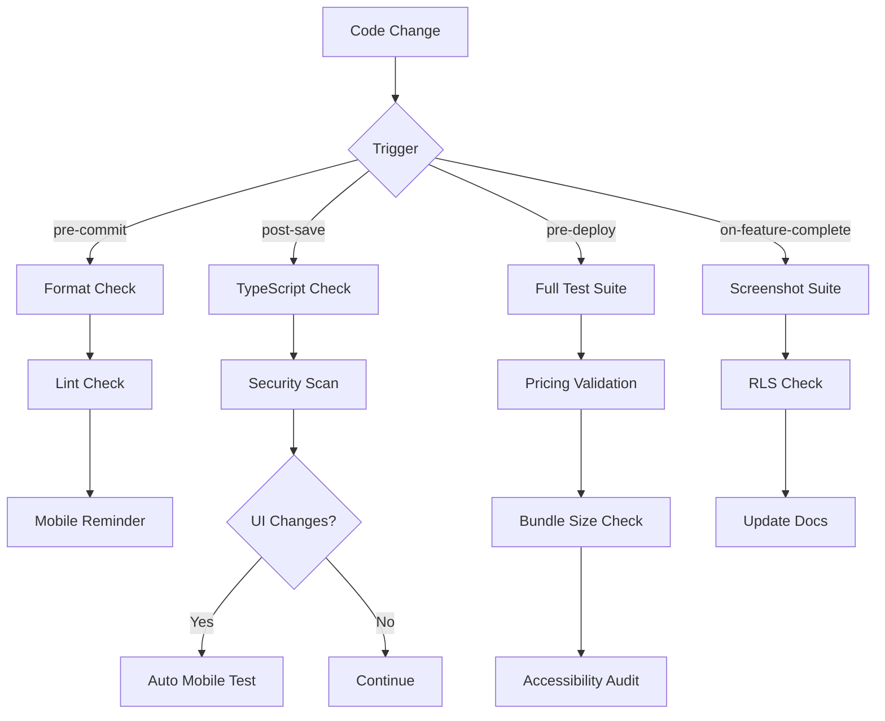

# Phase 6: Hooks & Automation Setup

## Overview
Hooks are automated scripts that run at specific lifecycle points in Claude Code to ensure code quality, security, and compliance with MRC standards.

---

## 📁 Directory Structure

```bash
.claude/
├── hooks/
│   ├── pre-commit/          # Run before code changes are saved
│   │   ├── format-check.sh
│   │   ├── lint-check.sh
│   │   └── mobile-viewport-reminder.sh
│   ├── post-save/           # Run after files are saved
│   │   ├── auto-test-mobile.sh
│   │   ├── typescript-check.sh
│   │   └── security-scan.sh
│   ├── pre-deploy/          # Run before deployment
│   │   ├── full-test-suite.sh
│   │   ├── pricing-validation.sh
│   │   ├── bundle-size-check.sh
│   │   └── accessibility-audit.sh
│   └── on-feature-complete/ # Run when marking feature as done
│       ├── mobile-screenshot-suite.sh
│       ├── supabase-rls-check.sh
│       └── update-docs.sh
```

---

## 🔧 Hook Scripts

### 1. Pre-Commit Hooks

#### `.claude/hooks/pre-commit/format-check.sh`
```bash
#!/bin/bash
# Ensure code formatting meets standards

echo "🎨 Running Prettier format check..."

# Check if Prettier is installed
if ! command -v prettier &> /dev/null; then
    echo "❌ Prettier not found. Install with: npm install -D prettier"
    exit 1
fi

# Run Prettier check
npx prettier --check "src/**/*.{ts,tsx,css,md}" || {
    echo "❌ Formatting issues found. Run 'npm run format' to fix."
    exit 1
}

echo "✅ Code formatting looks good!"
```

#### `.claude/hooks/pre-commit/lint-check.sh`
```bash
#!/bin/bash
# Run ESLint to catch code issues

echo "🔍 Running ESLint..."

# Check if ESLint is installed
if ! command -v eslint &> /dev/null; then
    echo "❌ ESLint not found. Install with: npm install -D eslint"
    exit 1
fi

# Run ESLint
npx eslint "src/**/*.{ts,tsx}" --max-warnings 0 || {
    echo "❌ Linting errors found. Fix issues before committing."
    exit 1
}

echo "✅ No linting issues!"
```

#### `.claude/hooks/pre-commit/mobile-viewport-reminder.sh`
```bash
#!/bin/bash
# Remind to test mobile viewports (critical for MRC)

echo "📱 MOBILE-FIRST REMINDER:"
echo "   Have you tested at 375px viewport width?"
echo "   - Use: @mobile-tester subagent"
echo "   - Or: npm run test:mobile"
echo ""
echo "   Remember: MRC technicians work on phones! 🚨"
echo ""
read -p "Press Enter to continue..."
```

---

### 2. Post-Save Hooks

#### `.claude/hooks/post-save/auto-test-mobile.sh`
```bash
#!/bin/bash
# Automatically trigger mobile tests when UI components change

# Detect if changed files are UI-related
CHANGED_FILES=$(git diff --name-only HEAD~1 HEAD)

if echo "$CHANGED_FILES" | grep -E "components/|pages/|styles/" > /dev/null; then
    echo "🔄 UI changes detected. Running mobile viewport tests..."
    
    # Trigger mobile-tester subagent via Claude Code API
    # (This would call the Playwright MCP server)
    npx playwright test --grep "@mobile" --headed || {
        echo "⚠️  Mobile tests failed. Review screenshots in test-results/"
    }
else
    echo "ℹ️  No UI changes detected. Skipping mobile tests."
fi
```

#### `.claude/hooks/post-save/typescript-check.sh`
```bash
#!/bin/bash
# Immediate TypeScript type checking

echo "🔎 Running TypeScript type check..."

npx tsc --noEmit || {
    echo "❌ TypeScript errors found. Fix before proceeding."
    exit 1
}

echo "✅ TypeScript types are valid!"
```

#### `.claude/hooks/post-save/security-scan.sh`
```bash
#!/bin/bash
# Quick security scan for common issues

echo "🔒 Running security scan..."

# Check for hardcoded secrets
if grep -r "SUPABASE_KEY\|API_KEY\|SECRET" --include="*.ts" --include="*.tsx" src/; then
    echo "⚠️  WARNING: Possible hardcoded secrets detected!"
    echo "   Use environment variables instead."
fi

# Check for console.log in production code
if grep -r "console\.log" --include="*.ts" --include="*.tsx" src/ | grep -v "// OK"; then
    echo "⚠️  WARNING: console.log statements found in code"
    echo "   Remove or use proper logging library."
fi

# Run npm audit (quick)
npm audit --audit-level=high || {
    echo "⚠️  High severity vulnerabilities found. Run 'npm audit fix'"
}

echo "✅ Security scan complete!"
```

---

### 3. Pre-Deploy Hooks

#### `.claude/hooks/pre-deploy/full-test-suite.sh`
```bash
#!/bin/bash
# Comprehensive testing before deployment

echo "🧪 Running full test suite..."

# Unit tests
echo "  → Running unit tests..."
npm run test:unit || exit 1

# Integration tests
echo "  → Running integration tests..."
npm run test:integration || exit 1

# E2E tests (Playwright)
echo "  → Running E2E tests (all viewports)..."
npx playwright test || exit 1

# Visual regression tests
echo "  → Running visual regression tests..."
npx playwright test --grep "@visual" || exit 1

echo "✅ All tests passed!"
```

#### `.claude/hooks/pre-deploy/pricing-validation.sh`
```bash
#!/bin/bash
# Validate MRC pricing calculations (CRITICAL)

echo "💰 Validating pricing calculator..."

# Run pricing test suite
npm run test:pricing || {
    echo "❌ CRITICAL: Pricing calculation tests failed!"
    echo "   This is a blocker for deployment. Fix immediately."
    exit 1
}

# Test discount cap (13% maximum)
echo "  → Testing 13% discount cap..."
node scripts/test-discount-cap.js || exit 1

# Test GST calculations (10%)
echo "  → Testing GST calculations..."
node scripts/test-gst.js || exit 1

echo "✅ Pricing calculations validated!"
```

#### `.claude/hooks/pre-deploy/bundle-size-check.sh`
```bash
#!/bin/bash
# Check bundle size for mobile performance

echo "📦 Checking bundle size..."

# Build production bundle
npm run build

# Check bundle size
BUNDLE_SIZE=$(du -sk dist/assets/index*.js | cut -f1)
MAX_SIZE=500 # 500KB max

if [ "$BUNDLE_SIZE" -gt "$MAX_SIZE" ]; then
    echo "❌ Bundle size too large: ${BUNDLE_SIZE}KB (max: ${MAX_SIZE}KB)"
    echo "   Optimize before deploying to production."
    exit 1
fi

echo "✅ Bundle size OK: ${BUNDLE_SIZE}KB"
```

#### `.claude/hooks/pre-deploy/accessibility-audit.sh`
```bash
#!/bin/bash
# Run accessibility audit (WCAG 2.1 AA)

echo "♿ Running accessibility audit..."

# Run axe-core tests
npx @axe-core/cli http://localhost:5173 --exit || {
    echo "⚠️  Accessibility issues found. Review report."
}

# Check for missing alt text on images
echo "  → Checking for alt text on images..."
if grep -r "<img" --include="*.tsx" src/ | grep -v "alt="; then
    echo "⚠️  Images without alt text found!"
fi

# Check color contrast
echo "  → Checking color contrast..."
npx playwright test --grep "@contrast" || {
    echo "⚠️  Color contrast issues detected."
}

echo "✅ Accessibility audit complete!"
```

---

### 4. On-Feature-Complete Hooks

#### `.claude/hooks/on-feature-complete/mobile-screenshot-suite.sh`
```bash
#!/bin/bash
# Generate mobile screenshots for all viewports

echo "📸 Generating mobile screenshot suite..."

# Use mobile-tester subagent via Playwright MCP
npx playwright test --grep "@screenshot" \
    --project=mobile,tablet,desktop || {
    echo "⚠️  Screenshot generation incomplete."
}

# Save to documentation
mkdir -p docs/screenshots
mv test-results/screenshots/* docs/screenshots/

echo "✅ Screenshots saved to docs/screenshots/"
```

#### `.claude/hooks/on-feature-complete/supabase-rls-check.sh`
```bash
#!/bin/bash
# Verify Supabase RLS policies are in place

echo "🔐 Checking Supabase RLS policies..."

# Use supabase-specialist subagent
# Check if all tables have RLS enabled
supabase db remote exec "
SELECT tablename 
FROM pg_tables 
WHERE schemaname = 'public' 
AND tablename NOT IN (
    SELECT tablename 
    FROM pg_policies
);" || {
    echo "❌ Tables without RLS policies found!"
    exit 1
}

echo "✅ All tables have RLS policies!"
```

#### `.claude/hooks/on-feature-complete/update-docs.sh`
```bash
#!/bin/bash
# Auto-update documentation

echo "📚 Updating documentation..."

# Generate API documentation
npx typedoc --out docs/api src/

# Update TODO list
node scripts/update-todo.js

# Commit docs
git add docs/
git commit -m "docs: auto-update documentation"

echo "✅ Documentation updated!"
```

---

## ⚙️ Configuration File

### `.claude/settings.json` (Updated)
```json
{
  "mcpServers": {
    "supabase-dev": {
      "alwaysAllow": [],
      "alwaysReject": ["delete", "drop"]
    },
    "playwright": {
      "alwaysAllow": ["browser_navigate", "browser_snapshot", "browser_take_screenshot"],
      "alwaysReject": []
    },
    "github": {
      "alwaysAllow": ["list_repos", "create_issue"],
      "alwaysReject": ["delete_repo", "force_push"]
    },
    "filesystem": {
      "alwaysAllow": ["read"],
      "alwaysReject": ["delete", "move"]
    }
  },
  "hooks": {
    "preCommit": [
      ".claude/hooks/pre-commit/format-check.sh",
      ".claude/hooks/pre-commit/lint-check.sh",
      ".claude/hooks/pre-commit/mobile-viewport-reminder.sh"
    ],
    "postSave": [
      ".claude/hooks/post-save/typescript-check.sh",
      ".claude/hooks/post-save/security-scan.sh"
    ],
    "preDeploy": [
      ".claude/hooks/pre-deploy/full-test-suite.sh",
      ".claude/hooks/pre-deploy/pricing-validation.sh",
      ".claude/hooks/pre-deploy/bundle-size-check.sh",
      ".claude/hooks/pre-deploy/accessibility-audit.sh"
    ],
    "onFeatureComplete": [
      ".claude/hooks/on-feature-complete/mobile-screenshot-suite.sh",
      ".claude/hooks/on-feature-complete/supabase-rls-check.sh",
      ".claude/hooks/on-feature-complete/update-docs.sh"
    ]
  },
  "commands": {
    "test:mobile": "npx playwright test --grep @mobile --project=mobile",
    "test:pricing": "npm run test -- src/__tests__/pricing.test.ts",
    "audit": "npm audit && npx playwright test --grep @security"
  }
}
```

---

## 🎯 Hook Execution Flow



---

## 📝 NPM Scripts to Add

Add these to `package.json`:

```json
{
  "scripts": {
    "format": "prettier --write \"src/**/*.{ts,tsx,css,md}\"",
    "format:check": "prettier --check \"src/**/*.{ts,tsx,css,md}\"",
    "lint": "eslint \"src/**/*.{ts,tsx}\" --max-warnings 0",
    "lint:fix": "eslint \"src/**/*.{ts,tsx}\" --fix",
    "type-check": "tsc --noEmit",
    "test:unit": "vitest run",
    "test:integration": "vitest run --config vitest.integration.config.ts",
    "test:e2e": "playwright test",
    "test:mobile": "playwright test --grep @mobile --project=mobile",
    "test:pricing": "vitest run src/__tests__/pricing.test.ts",
    "test:security": "playwright test --grep @security",
    "test:accessibility": "playwright test --grep @a11y",
    "test:visual": "playwright test --grep @visual",
    "audit:security": "npm audit && npm run test:security",
    "pre-deploy": "npm run lint && npm run type-check && npm run test:e2e && npm run test:pricing"
  }
}
```

---

## 🚀 Installation Steps

```bash
# 1. Create hooks directory
mkdir -p .claude/hooks/{pre-commit,post-save,pre-deploy,on-feature-complete}

# 2. Copy all hook scripts from this document into respective directories

# 3. Make all hooks executable
chmod +x .claude/hooks/**/*.sh

# 4. Install required npm packages
npm install -D \
  prettier \
  eslint \
  @typescript-eslint/eslint-plugin \
  @typescript-eslint/parser \
  @axe-core/cli \
  vitest \
  @playwright/test

# 5. Verify hook setup
ls -la .claude/hooks/**/*.sh
```

---

## ✅ Verification

Test each hook manually:

```bash
# Test pre-commit hooks
.claude/hooks/pre-commit/format-check.sh
.claude/hooks/pre-commit/lint-check.sh

# Test post-save hooks
.claude/hooks/post-save/typescript-check.sh
.claude/hooks/post-save/security-scan.sh

# Test pre-deploy hooks
.claude/hooks/pre-deploy/pricing-validation.sh
.claude/hooks/pre-deploy/bundle-size-check.sh

# Test on-feature-complete hooks
.claude/hooks/on-feature-complete/mobile-screenshot-suite.sh
```

---

## 🎯 MRC-Specific Hook Features

### Australian Business Compliance Checks
- Currency format validation ($X,XXX.XX)
- Phone number format ((03) XXXX XXXX, 04XX XXX XXX)
- ABN format (XX XXX XXX XXX)
- Date format (DD/MM/YYYY)
- Australian spelling checks

### Mobile-First Enforcement
- 375px viewport testing reminder (EVERY commit)
- 48px touch target validation
- No horizontal scroll checks
- <3 second load time validation

### Pricing Calculator Protection
- 13% discount cap validation (blocker)
- GST calculation verification (10%)
- Melbourne zone pricing checks
- Equipment hire rate validation

---

## 🔄 Workflow Integration

When Claude Code works on MRC features:

1. **Before ANY UI change** → Mobile-first reminder
2. **After file save** → TypeScript + security scan
3. **Before marking feature complete** → Full screenshot suite
4. **Before deployment** → Comprehensive test suite + pricing validation

This ensures **zero regression** and **bulletproof quality** for business-critical operations.

---